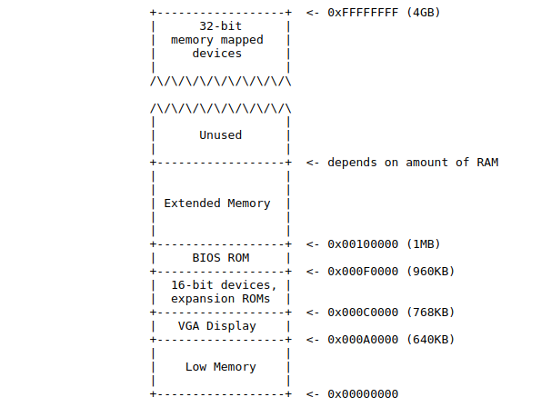

## 实验 1：PC 的引导过程

### 简介
这个实验分为三个部分。第一部分主要是为了熟悉使用 x86 汇编语言、QEMU x86 仿真器、以及 PC 的加电引导过程。第二部分查看我们的 6.828 内核的引导加载器，它位于 `lab` 树的 `boot` 目录中。第三部分深入到我们的名为 JOS 的 6.828 内核模型内部，它在 `kernel` 目录中。

#### 软件安装
本课程中你需要的文件和接下来的实验任务所需要的文件都是通过使用 [Git](http://www.git-scm.com/) 版本控制系统来分发的。学习更多关于 Git 的知识，请查看 [Git user's manual](http://www.kernel.org/pub/software/scm/git/docs/user-manual.html)，或者，如果你熟悉其它的版本控制系统，这个 [CS-oriented overview of Git](http://eagain.net/articles/git-for-computer-scientists/) 可能对你有帮助。

本课程在 Git 仓库中的地址是 https://exokernel.scripts.mit.edu/joslab.git 。在你的 Athena 帐户中安装文件，你需要运行如下的命令去克隆课程仓库。你也可以使用 `ssh -X athena.dialup.mit.edu` 去登入到一个公共的 Athena 主机。
```python
athena% mkdir ~/6.828
athena% cd ~/6.828
athena% add git
athena% git clone https://exokernel.scripts.mit.edu/joslab.git lab
Cloning into lab...
athena% cd lab
athena%

img = cv2.imread('example.png',0)
cv2.namedWindow("Example",cv2.WINDOW_AUTOSIZE)
cv2.imshow('Example',img)
cv2.waitKey(0)
cv2.destroyAllWindows()
```
Git 可以帮你跟踪代码中的变化。比如，如果你完成了一个练习，想在你的进度中打一个检查点，你可以运行如下的命令去提交你的变更：
```shell
athena% git commit -am 'my solution for lab1 exercise 9'
Created commit 60d2135: my solution for lab1 exercise 9
 1 files changed, 1 insertions(+), 0 deletions(-)
athena%
```
你可以使用 `git diff` 命令跟踪你的变更。运行 `git diff` 将显示你的代码自最后一次提交之后的变更，而 `git diff origin/lab1` 将显示这个实验相对于初始代码的变更。在这里，`origin/lab1` 是为了完成这个作业，从我们的服务器上下载的初始代码在 Git 分支上的名字。

在 Athena 上，我们为你配置了合适的编译器和模拟器。如果你要去使用它们，请运行 `add exokernel` 命令。 每次登入 Athena 主机你都必须要运行这个命令（或者你可以将它添加到你的 `~/.environment` 文件中）。如果你在编译或者运行 `qemu` 时出现晦涩难懂的错误，可以双击 "check" 将它添加到你的课程收藏夹中。

如果你使用的是非 Athena 机器，你需要安装 `qemu` 和 `gcc`，它们在 [工具页面](https://sipb.mit.edu/iap/6.828/tools) 目录中。为了以后的实验需要，我们做了一些 qemu 调试方面的变更和补丁，因此，你必须构建你自己的工具。如果你的机器使用原生的 ELF 工具链（比如，Linux 和大多数 BSD，但不包括 OS X），你可以简单地从你的包管理器中安装 `gcc`。除此之外，都应该按工具页面的指导去做。

#### 动手过程
我们为了你便于做实验，为你使用了不同的 Git 仓库。做实验用的仓库位于一个 SSH 服务器后面。你可以拥有你自己的实验仓库，其他的任何同学都不可访问你的这个仓库。为了通过 SSH 服务器的认证，你必须有一对 RSA 密钥，并让服务器知道你的公钥。

实验代码同时还带有一个脚本，它可以帮你设置如何访问你的实验仓库。在运行这个脚本之前，你必须在我们的 [submission web](https://exokernel.scripts.mit.edu/submit/) 界面 上有一个帐户。在登陆页面上，输入你的 Athena 用户名，然后点击 “Mail me my password”。在你的邮箱中将马上接收到一封包含有你的 `6.828` 课程密码的邮件。注意，每次你点击这个按钮的时候，系统将随机给你分配一个新密码。

现在，你已经有了你的 `6.828` 密码，在 `lab` 目录下，运行如下的命令去配置实践仓库：

```shell
athena% make handin-prep
Using public key from ~/.ssh/id_rsa:
ssh-rsa AAAAB3NzaC1yc2EAAAADAQABAAABAQD0lnnkoHSi4JDFA ...
Continue? [Y/n] Y

Login to 6.828 submission website.
If you do not have an account yet, sign up at https://exokernel.scripts.mit.edu/submit/
before continuing.
Username: <your Athena username>
Password: <your 6.828 password>
Your public key has been successfully updated.
Setting up hand-in Git repository...
Adding remote repository ssh://josgit@exokernel.mit.edu/joslab.git as 'handin'.
Done! Use 'make handin' to submit your lab code.
athena%
```

如果你没有 RSA 密钥对，这个脚本可能会询问你是否生成一个新的密钥对：
```shell
athena% make handin-prep
SSH key file ~/.ssh/id_rsa does not exists, generate one? [Y/n] Y
Generating public/private rsa key pair.
Your identification has been saved in ~/.ssh/id_rsa.
Your public key has been saved in ~/.ssh/id_rsa.pub.
The key fingerprint is:
xx:xx:xx:xx:xx:xx:xx:xx:xx:xx:xx:xx:xx:xx:xx:xx
The keyʼs randomart image is:
+--[ RSA 2048]----+
| ........ |
| ........ |
+-----------------+
Using public key from ~/.ssh/id_rsa:
ssh-rsa AAAAB3NzaC1yc2EAAAADAQABAAABAQD0lnnkoHSi4JDFA ...
Continue? [Y/n] Y
.....
athena%
```
当你开始动手做实验时，在 `lab` 目录下，输入 `make handin` 去使用 git 做第一次提交。后面将运行 `git push handin HEAD`，它将推送当前分支到远程 `handin` 仓库的同名分支上。
```shell
athena% git commit -am "ready to submit my lab"
[lab1 c2e3c8b] ready to submit my lab
 2 files changed, 18 insertions(+), 2 deletions(-)

athena% make handin
Handin to remote repository using 'git push handin HEAD' ...
Counting objects: 59, done.
Delta compression using up to 4 threads.
Compressing objects: 100% (55/55), done.
Writing objects: 100% (59/59), 49.75 KiB, done.
Total 59 (delta 3), reused 0 (delta 0)
To ssh://josgit@am.csail.mit.edu/joslab.git
 * [new branch] HEAD -> lab1
athena%
```
如果在你的实验仓库上产生变化，你将收到一封电子邮件，让你去确认这个提交。以后，你可能会多次去运行 `run make handin`（或者 `git push handin`）。对于一个指定实验的最后提交时间是由相应分支的最新推送（最后一个推送）的时间决定的。

在这个案例中，`make handin` 运行可能并不正确，你可以使用 Git 命令去尝试修复这个问题。或者，你可以去运行 `make tarball`。它将为你生成一个 tar 文件，这个文件可以通过我们的 [web 界面](https://exokernel.scripts.mit.edu/submit/) 来上传。`make handin` 提供了很多特殊说明。

对于实验 1，你不需要去回答下列的任何一个问题。（尽管你不用自己回答，但是它们对下面的实验有帮助）

我们将使用一个评级程序来分级你的解决方案。你可以使用这个评级程序去测试你的解决方案的分级情况。

### 第一部分：PC 引导
第一个练习的目的是向你介绍 x86 汇编语言和 PC 引导过程，你可以使用 QEMU 和 QEMU/GDB 调试开始你的练习。这部分的实验你不需要写任何代码，但是，通过这个实验，你将对 PC 引导过程有了你自己的理解，并且为回答后面的问题做好准备。
#### 从使用 x86 汇编语言开始
如果你对 x86 汇编语言的使用还不熟悉，通过这个课程，你将很快熟悉它！如果你想学习它，[PC 汇编语言](https://sipb.mit.edu/iap/6.828/readings/pcasm-book.pdf) 这本书是一个很好的开端。希望这本书中有你所需要的一切内容。

警告：很不幸，这本书中的示例是为 NASM 汇编语言写的，而我们使用的是 GNU 汇编语言。NASM 使用所谓的 Intel 语法，而 GNU 使用 AT&T 语法。虽然在语义上是等价的，但是根据你使用的语法不同，至少从表面上看，汇编文件的差别还是挺大的。幸运的是，这两种语法的转换很简单，在 [Brennan's Guide to Inline Assembly](http://www.delorie.com/djgpp/doc/brennan/brennan_att_inline_djgpp.html) 有详细的介绍。

> 练习 1：
> 熟悉在 [参考页面](../References.md) 上列出的你想去使用的可用汇编语言。你不需要现在就去阅读它们，但是在你阅读和写 x86 汇编程序的时候，你可以去参考相关的内容。

我并不推荐你阅读 [Brennan's Guide to Inline Assembly](http://www.delorie.com/djgpp/doc/brennan/brennan_att_inline_djgpp.html) 上的 “语法” 章节。虽然它对 AT&T 汇编语法描述的很好（并且非常详细），而且我们在 JOS 中使用的 GNU 汇编就是它。

对于 x86 汇编语言程序最终还是需要参考 Intel 的指令集架构，你可以在 [参考页面](../References.md) 上找到它，它有两个版本：一个是 HTML 版的，是老的 [80386 程序员参考手册](https://sipb.mit.edu/iap/6.828/readings/i386/toc.htm)，它比起最新的手册更简短，更易于查找，但是，它包含了我们的 6.828 上所使用的 x86 处理器的所有特性；而更全面的、更新的、更好的是，来自 Intel 的 [IA-32 Intel 架构软件开发者手册](http://www.intel.com/content/www/us/en/processors/architectures-software-developer-manuals.html)，它涵盖了我们在课程中所需要的、（并且可能有些是你不感兴趣的）大多数处理器的全部特性。另一个差不多的（并且经常是很友好的）一套手册是 [来自 AMD](http://developer.amd.com/documentation/guides/Pages/default.aspx#manuals) 的。当你为了一个特定的处理器特性或者指令，去查找最终的解释时，保存的最新的 Intel/AMD 架构手册或者它们的参考就很有用了。

#### 仿真 x86
与在一台真实的、物理的、个人电脑上引导一个操作系统不同，我们使用程序去如实地仿真一台完整的 PC：你在仿真器中写的代码，也能够引导一台真实的 PC。使用仿真器可以简化调试工作；比如，你可以在仿真器中设置断点，而这在真实的机器中是做不到的。


在 6.828 中，我们将使用 [QEMU 仿真器](http://www.qemu.org/)，它是一个现代化的并且速度非常快的仿真器。虽然 QEMU 内置的监视功能提供了有限的调试支持，但是，QEMU 也可以做为 [GNU 调试器](http://www.gnu.org/software/gdb/) (GDB) 的远程调试目标，我们在这个实验中将使用它来一步一步完成引导过程。

在开始之前，按照前面 “软件安装“ 中在 Athena 主机上描述的步骤，提取实验 1 的文件到你自己的目录中，然后，在 `lab` 目录中输入 `make`（如果是 BSD 的系统，是输入 `gmake` ）来构建最小的 6.828 引导加载器和用于启动的内核。（把在这里我们运行的这些代码称为 ”内核“ 有点夸大，但是，通过这个学期的课程，我们将把这些代码充实起来，成为真正的 ”内核“）
```shell
athena% cd lab
athena% make
+ as kern/entry.S
+ cc kern/init.c
+ cc kern/console.c
+ cc kern/monitor.c
+ cc kern/printf.c
+ cc lib/printfmt.c
+ cc lib/readline.c
+ cc lib/string.c
+ ld obj/kern/kernel
+ as boot/boot.S
+ cc -Os boot/main.c
+ ld boot/boot
boot block is 414 bytes (max 510)
+ mk obj/kern/kernel.img
```
（如果你看到有类似 "undefined reference to \`\__udivdi3'" 这样的错误，可能是因为你的电脑上没有 32 位的 “gcc multilib”。如果你运行在 Debian 或者 Ubuntu，你可以尝试去安装 “gcc-multilib” 包。）

现在，你可以去运行 QEMU 了，并将上面创建的 `obj/kern/kernel.img` 文件提供给它，以作为仿真 PC 的 “虚拟硬盘”，这个虚拟硬盘中包含了我们的引导加载器（`obj/boot/boot`) 和我们的内核（`obj/kernel`）。
```shell
athena% make qemu
```
运行 QEMU 时需要使用选项去设置硬盘，以及指示串行端口输出到终端。在 QEMU 窗口中将出现一些文本内容：
```shell
Booting from Hard Disk...
6828 decimal is XXX octal!
entering test_backtrace 5
entering test_backtrace 4
entering test_backtrace 3
entering test_backtrace 2
entering test_backtrace 1
entering test_backtrace 0
leaving test_backtrace 0
leaving test_backtrace 1
leaving test_backtrace 2
leaving test_backtrace 3
leaving test_backtrace 4
leaving test_backtrace 5
Welcome to the JOS kernel monitor!
Type 'help' for a list of commands.
K>
```
在 `Booting from Hard Disk...` 之后的内容，就是由我们的基本 JOS 内核输出的：`K>` 是包含在我们的内核中的小型监听器或者交互式控制程序的提示符。内核输出的这些行也会出现在你运行 QEMU 的普通 shell 窗口中。这是因为测试和实验分级的原因，我们配置了 JOS 的内核，使它将控制台输出不仅写入到虚拟的 VGA 显示器（就是 QEMU 窗口），也写入到仿真 PC 的虚拟串口上，QEMU 会将虚拟串口上的信息转发到它的标准输出上。同样，JOS 内核也将接收来自键盘和串口的输入，因此，你既可以从 VGA 显示窗口中输入命令，也可以从运行 QEMU 的终端窗口中输入命令。或者，你可以通过运行 `make qemu-nox` 来取消虚拟 VGA 的输出，只使用串行控制台来输出。如果你是通过 SSH 拨号连接到 Athena 主机，这样可能更方便。

在这里有两个可以用来监视内核的命令，它们是 `help` 和 `kerninfo`。
```shell
K> help
help - display this list of commands
kerninfo - display information about the kernel
K> kerninfo
Special kernel symbols:
 entry f010000c (virt) 0010000c (phys)
 etext f0101a75 (virt) 00101a75 (phys)
 edata f0112300 (virt) 00112300 (phys)
 end f0112960 (virt) 00112960 (phys)
Kernel executable memory footprint: 75KB
K>
```
`help` 命令的用途很明确，我们将简短地讨论一下 `kerninfo` 命令输出的内容。虽然它很简单，但是，需要重点注意的是，这个内核监视器是 “直接” 运行在仿真 PC 的 “原始（虚拟）硬件” 上的。这意味着你可以去拷贝 `obj/kern/kernel.img` 的内容到一个真实硬盘的前几个扇区，然后将那个硬盘插入到一个真实的 PC 中，打开这个 PC 的电源，你将在一台真实的 PC 屏幕上看到和上面在 QEMU 窗口完全一样的内容。（我们并不推荐你在一台真实机器上这样做，因为拷贝 `kernel.img` 到硬盘的前几个扇区将覆盖掉那个硬盘上原来的主引导记录，这将导致这个硬盘上以前的内容丢失！）

#### PC 的物理地址空间

我们现在将更深入去了解 “关于 PC 是如何启动” 的更多细节。一台 PC 的物理地址空间是硬编码为如下的布局：


```html
+------------------+  &lt;- 0xFFFFFFFF (4GB)
|      32-bit      |
|  memory mapped   |
|     devices      |
|                  |
/\/\/\/\/\/\/\/\/\/\
/\/\/\/\/\/\/\/\/\/\
|                  |
|      Unused      |
|                  |
+------------------+  - depends on amount of RAM
|                  |
|                  |
| Extended Memory  |
|                  |
|                  |
+------------------+  - 0x00100000 (1MB)
|     BIOS ROM     |
+------------------+  - 0x000F0000 (960KB)
|  16-bit devices, |
|  expansion ROMs  |
+------------------+  - 0x000C0000 (768KB)
|   VGA Display    |
+------------------+  - 0x000A0000 (640KB)
|                  |
|    Low Memory    |
|                  |
+------------------+  - 0x00000000
```

首先，这台 PC 是基于 16 位的 Intel 8088 处理器，它仅能处理 1 MB 的物理地址。所以，早期 PC 的物理地址空间开始于 0x00000000，结束于 0x000FFFFF 而不是 0xFFFFFFFF。被标记为 “低位内存” 的区域是早期 PC 唯一可以使用的随机访问内存（RAM）；事实上，更早期的 PC 仅可以配置 16KB、32KB、或者 64KB 的内存！

从 0x000A0000 到 0x000FFFFF 的 384 KB 的区域是为特定硬件保留的区域，比如，视频显示缓冲和保存在非易失存储中的固件。这个保留区域中最重要的部分是基本输入/输出系统（BIOS），它位于从 0x000F0000 到 0x000FFFFF 之间的 64KB 大小的区域。在早期的 PC 中，BIOS 在真正的只读存储（ROM）中，但是，现在的 PC 的 BIOS 都保存在可更新的 FLASH 存储中。BIOS 负责执行基本系统初始化工作，比如，激活视频卡和检查已安装的内存数量。这个初始化工作完成之后，BIOS 从相关位置加载操作系统，比如从软盘、硬盘、CD-ROM、或者网络，然后将机器的控制权传递给操作系统。

当 Intel 最终在 80286 和 80386 处理器上 “打破了 1MB 限制” 之后，这两个处理器各自支持 16MB 和 4GB 物理地址空间，尽管如此，为了确保向下兼容现存软件，PC 架构还是保留着 1 MB 以内物理地址空间的原始布局。因此，现代 PC 的物理内存，在 0x000A0000 和 0x00100000 之间有一个 “黑洞区域”，将内存分割为 “低位” 或者 “传统内存” 区域（前 640 KB）和 “扩展内存”（其它的部分）。除此之外，在 PC 的 32 位物理地址空间顶部之上的一些空间，在全部的物理内存上面，现在一般都由 BIOS 保留给 32 位的 PCI 设备使用。

最新的 x86 处理器可以支持超过 4GB 的物理地址空间，因此，RAM 可以进一步扩展到 0xFFFFFFFF 之上。在这种情况下，BIOS 必须在 32 位可寻址空间顶部之上的系统 RAM 上，设置第二个 “黑洞区域”，以便于为这些 32 位的设备映射留下空间。因为 JOS 设计的限制，它仅可以使用 PC 物理内存的前 256 MB，因此，我们将假设所有的 PC “仅仅” 拥有 32 位物理地址空间。但是处理复杂的物理地址空间和其它部分的硬件系统，将涉及到许多年前操作系统开发所遇到的实际挑战之一。

